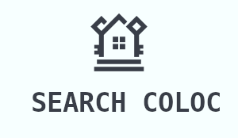

<div align="center">


This project showcase how to use the LaCarteDesColocs Email Push Notification with Google API to automate the flat share process.

</div>

### Pre-requisites
- A Google Cloud Platform account with the Gmail API and Maps enabled.
- An API key for the Google Maps API.
- A `credentials.json` file for the Gmail API.
- Mail Notifications from LaCarteDesColocs enabled. 

>[!IMPORTANT]
> You need to have a `.env` file with the following variables:
> - `GOOGLE_MAPS_API_KEY` : Your Google Maps API key.

### Usage

```bash
git clone git@github.com:GridexX/search-coloc.git
cd search-coloc
npm install
npm start
```

The script will parse the mail from LaCarteDesColocs and save a JSON file with the data. It will then use the Google Maps API to get the distance between the flat and the user's work address. Finally, it will send an email with the flat details and the distance.